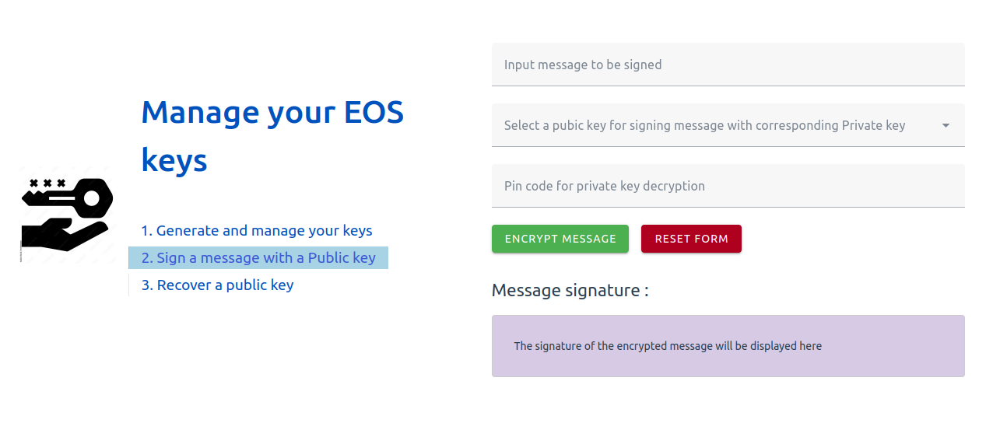

# eos-keys-management-testapp


## App for :
- Generate Public / Private key pairs
- Manage them
- Encrypt / decrypt
- Sign message
- Recover public key from signature 

## Author

Frédéric ZINGG

## Framework and libraries used
- [Vuejs V3](https://vuejs.org/)
- [eosjs API](https://github.com/EOSIO/eosjs) 
- [crypto-js](https://github.com/brix/crypto-js)

## App Screenshot




## Keys pair generation, encryption and storage descripton

STEP 1: Public key and Private key generation

STEP 2: Private ket encrypted with pin code

STEP 3: Public key and **encrypted** Private key stored in `localStorage`

The Private key is never stored without encryption of course.

Below the 5 keys structure stored in `localStorage`

```
generatedpublickeys: [
        { publickey: 'key1', encryptedprivatekey: 'encPrivKey1' },
        { publickey: 'key2', encryptedprivatekey: 'encPrivKey2' },
        { publickey: 'key3', encryptedprivatekey: 'encPrivKey3' },
        { publickey: 'key4', encryptedprivatekey: 'encPrivKey4' },
        { publickey: 'key5', encryptedprivatekey: 'encPrivKey5' },
      ]
```

## Project files description

`src/mixins/crypto-utils.ts` 

This is where all useful cryptograhics and storage methods used in the app are located.


## Project Setup

```sh
npm install
```

### Compile and Hot-Reload for Development

```sh
npm run dev
```

### Type-Check, Compile and Minify for Production

```sh
npm run build
```

### Run Unit Tests with [Vitest](https://vitest.dev/)

```sh
npm run test:unit
```
